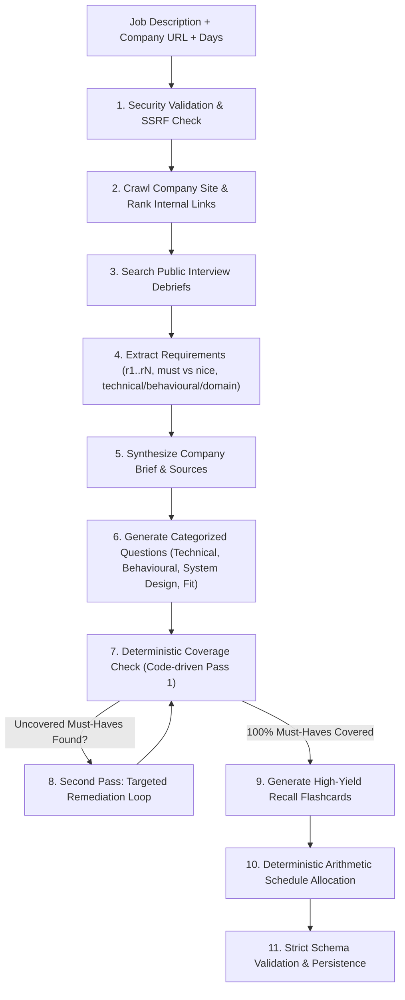

# PrepKIT

### AI-Powered Interview Preparation Platform

PrepKIT is a full-stack AI application designed to help candidates prepare for technical interviews in a structured and personalized way.

Given a job description and company website, PrepKIT researches the role and company, identifies relevant technical areas, generates targeted interview questions, creates flashcards and study plans, and provides interactive practice workflows.

The goal is to turn an unstructured job opportunity into a practical, day-by-day interview preparation system.

---

## Live Public Deployment URLs

- **Public Frontend Application**: [https://prepkit-frontend.onrender.com](https://prepkit-frontend.onrender.com)
- **Public Backend API**: [https://prepkit-backend-kt9o.onrender.com](https://prepkit-backend-kt9o.onrender.com)
- **Backend Health Check**: [https://prepkit-backend-kt9o.onrender.com/api/health](https://prepkit-backend-kt9o.onrender.com/api/health)

*Both the frontend and backend are publicly accessible over HTTPS with persistent data storage, end-to-end user registration, company crawling, requirement extraction, and kit generation verified.*

---

## Table of Contents

1. [Project Overview & Tech Stack](#1-project-overview--tech-stack)
2. [Why I Built PrepKIT](#2-why-i-built-prepkit)
3. [Core Features](#3-core-features)
4. [High-Level Architecture](#4-high-level-architecture)
5. [Research & Crawling Pipeline](#5-research--crawling-pipeline)
6. [AI Generation Pipeline & Coverage Loop](#6-ai-generation-pipeline--coverage-loop)
7. [PrepKit Builder & Editing Workflow](#7-prepkit-builder--editing-workflow)
8. [Deterministic Study Scheduling](#8-deterministic-study-scheduling)
9. [Practice Mode & Spaced Repetition](#9-practice-mode--spaced-repetition)
10. [Mock Interview & AI Coaching](#10-mock-interview--ai-coaching)
11. [Printable One-Pager Cheat Sheet](#11-printable-one-pager-cheat-sheet)
12. [Batch Processing & Developer CLI](#12-batch-processing--developer-cli)
13. [Edge Cases & Failure Handling](#13-edge-cases--failure-handling)
14. [Security & Prompt Injection Defense](#14-security--prompt-injection-defense)
15. [Quickstart & Setup](#15-quickstart--setup)
16. [Automated Testing & Verification](#16-automated-testing--verification)
17. [Walkthrough Video Script (3-4 Minutes)](#17-walkthrough-video-script-3-4-minutes)

---

## 1. Project Overview & Tech Stack

PrepKIT was engineered as a production-grade, modular web application combining resilient web crawling, multi-model AI generation, deterministic algorithms for math-heavy allocations, and an interactive state-preserving frontend.

| Layer | Technology | Key Implementation Highlights |
|---|---|---|
| **Frontend** | **Next.js 15 (App Router) + Tailwind CSS** | Server-side rendering, optimistic UI state, accessible keyboard shortcuts, responsive mobile & desktop views, clean aesthetic. |
| **Backend** | **Node.js + Express** | Clean separation of concerns across controllers, middleware, Server-Sent Events (SSE) progress streaming, and data services. |
| **Database** | **MongoDB (Mongoose) + Zero-Config Embedded Store** | Dual-mode persistence: connects seamlessly to MongoDB when `MONGODB_URI` is provided, with an automatic fallback to an embedded local file datastore (`data/db.json`) for instant zero-dependency local runs. |
| **Language** | **TypeScript (Strict Mode)** | 100% end-to-end typed contracts across crawler outputs, AI schemas, API endpoints, and client hooks. |
| **Scraping** | **Axios + Cheerio + Dynamic Heuristic Ranker** | Multi-page crawler discovering buried career paths, handbooks, and blogs with robots.txt compliance and SSRF protection. |
| **AI / LLM** | **Google Gemini (`gemini-2.0-flash`), Groq, OpenAI** | Multi-provider client with token-bucket rate limiting, exponential backoff with jitter, structured JSON schema validation, and an offline mock engine. |

---

## 2. Why I Built PrepKIT

Technical interview preparation is broken in two distinct ways:
1. **Generic Question Lists**: Most candidates practice from generic LeetCode or top-50 question lists that bear zero resemblance to what the specific hiring company actually builds, how their engineering team works, or the exact stack requirements in the job description.
2. **One-Shot "Lazy" AI Summaries**: Most AI tools generate a superficial, single-shot wall of text that cannot be reshaped, does not verify whether all requirements are covered, hallucinates company facts when URLs fail, and dumps unstructured advice without a realistic schedule.

PrepKIT solves this by:
- **Crawling and ground-truthing the company**: Actively seeking out the company's real engineering handbooks, blogs, and public interview debriefs.
- **Enforcing deliberate pipeline steps**: Extracting requirements first, generating questions per category, and algorithmically verifying that every single must-have requirement has dedicated preparation material.
- **Separating arithmetic from LLMs**: Calculating day-by-day schedules with deterministic code rather than letting an unpredictable prompt do math.
- **Providing active practice**: Turning passive reading into 3D interactive flashcard review with spaced repetition and an AI voice/text mock interview coach with structured rubric grading.

---

## 3. Core Features

- **Live Research & Progress Visualizer**: Streams real-time progress steps (crawling, link ranking, requirement extraction, gap analysis, scheduling) via Server-Sent Events (SSE).
- **Personalized Preparation Kits**:
  - Truthful company brief and technical operating model with verified source URLs.
  - Role breakdown with seniority, responsibilities, and must-have vs. nice-to-have requirements.
  - Categorized Question Bank partitioned into Technical, Behavioural (STAR framework outlines), System Design, and Company Fit.
  - High-yield recall flashcard decks.
- **The Kit Builder**:
  - Inline editing of prompts, answer outlines, and briefs with auto-saving.
  - Drag-and-drop / category switching to move questions across sections.
  - Adding custom questions and deleting unneeded ones.
  - **State-Preserving Regeneration**: User-edited, manually added, or pinned questions survive section regeneration.
- **Deterministic Study Schedule**:
  - Pure arithmetic allocation across the exact number of days available (1 to 60 days).
  - High-priority must-haves and harder material land earlier; final review lands at the end.
- **Interactive Practice Mode**:
  - 3D flip card animations with Spacebar toggle and keyboard shortcuts (1, 2, 3).
  - Tracks confidence ratings and automatically queues future rounds with lowest-confidence cards first.
- **AI Mock Interview Coach**:
  - Voice dictation (Web Speech API) or text typing.
  - Grades candidate responses against a 4-point rubric (Technical Depth, STAR Structure, Company Alignment, Clarity) and generates an exemplary model answer.
- **Printable One-Pager Cheat Sheet**:
  - High-density, printer-friendly summary for last-minute review 30 minutes before the interview.
- **Batch Processing & CLI**:
  - Developer command-line runner (`npm run evaluate`) for batch-processing multiple roles in parallel with structured JSON exports.

---

## 4. High-Level Architecture

```
PrepKIT/
├── src/
│   ├── core/                        # Decoupled Core Pipeline Engine
│   │   ├── crawler/                 # Multi-page crawler, link ranker, robots.txt, SSRF guard
│   │   ├── llm/                     # Multi-provider AI client, rate limiter, backoff handler
│   │   ├── extraction/              # Job description role & requirement extractor
│   │   ├── generation/              # Company brief, question bank, flashcard generators
│   │   ├── coverage/                # Deterministic gap checker & Second-Pass loop
│   │   ├── scheduler/               # Deterministic arithmetic day-by-day allocator
│   │   ├── validator/               # Strict Zod schema validators
│   │   └── pipeline.ts              # Master pipeline orchestrator
│   ├── cli/
│   │   └── evaluate.ts              # CLI command for batch processing cases
│   ├── server/                      # Express Backend API
│   │   ├── index.ts                 # Endpoints & SSE streaming
│   │   ├── auth.ts                  # JWT session authentication & bcrypt hashing
│   │   ├── db.ts                    # MongoDB + zero-config embedded store
│   │   └── mockInterview.ts         # AI mock interview rubric evaluator
│   └── app/                         # Next.js 15 Frontend (App Router)
│       ├── page.tsx                 # Dashboard & batch upload modal
│       ├── generate/page.tsx        # Kit generator with live SSE stage progress
│       ├── kit/[id]/page.tsx        # The Kit Builder (Editor & Section Regenerator)
│       ├── kit/[id]/practice/       # Practice Mode (3D Flashcards & Spaced Repetition)
│       ├── kit/[id]/schedule/       # Study Schedule Roadmap & Day Checklists
│       ├── kit/[id]/mock-interview/ # AI Mock Interviewer & Rubric Coach
│       └── kit/[id]/cheat-sheet/    # Printable 1-Pager Cheat Sheet
├── tests/                           # Vitest automated test suite (20/20 tests passing)
├── cases.example.json               # Sample batch input cases
└── README.md
```

---

## 5. Research & Crawling Pipeline

Companies bury hiring processes and architecture details in unpredictable places—some use `/careers`, others use `/jobs`, public employee handbooks (GitLab), engineering blogs, or culture decks. PrepKIT uses dynamic heuristic scoring rather than hardcoded URLs.

### Dynamic Link Ranking Algorithm (`src/core/crawler/ranker.ts`)
1. **Target Discovery**: Scans all `<a href>` links on the company landing page and resolves relative paths to absolute URLs.
2. **Relevance Scoring**:
   - **Hiring & Process Keywords (+35 to +65 pts)**: `career`, `jobs`, `join`, `hiring`, `handbook`, `interview`, `engineering-blog`, `culture`, `team`.
   - **Company Mission & Architecture (+25 to +45 pts)**: `about`, `mission`, `what-we-do`, `platform`, `technology`, `how-it-works`.
   - **Penalties (-100 pts)**: `privacy`, `terms`, `cookie`, `login`, `signup`, `cart`, `checkout`.
3. **Robots.txt & Concurrency**: Fetches `/robots.txt`, respects `Disallow` and `Crawl-Delay` rules, and crawls candidate pages concurrently with strict timeout handling.
4. **Content Cleaning**: Cheerio strips scripts, stylesheets, tracking pixels, and navigation clutter, limiting text size to protect context limits.
5. **Public Interview Discussions**: Looks up community interview debriefs and discussions (Glassdoor, Reddit). If none are found, it truthfully reports this rather than fabricating rounds.

---

## 6. AI Generation Pipeline & Coverage Loop

The preparation kit is produced through a deliberate sequence of decoupled steps where each stage responds to verified facts from prior stages:



### Truthful Requirement Extraction
- Identifies title, seniority level, core responsibilities, and explicit requirements.
- Assigns stable IDs (`r1`, `r2`, `r3`...), categories (`technical`, `behavioural`, `domain`), and priorities (`must` vs `nice`).
- **Anti-Hallucination Rule**: If a job description is a 2-line stub, it extracts only what is present and produces an honest, concise kit. It never invents phantom skills.

### The Second-Pass Coverage Loop
1. Code compares all question `requirement_ids` against the extracted requirements list.
2. If any must-have requirement has no question testing it, it is flagged as an uncovered gap.
3. The pipeline triggers a targeted Second Pass LLM call focused exclusively on the missing requirement IDs.
4. Gaps are merged with new unique IDs, and coverage is re-verified deterministically.

---

## 7. PrepKit Builder & Editing Workflow

A prep kit nobody can customize is useless. PrepKIT's Builder allows candidates to reshape any aspect of their kit while preserving personal modifications.

### State Architecture: Provenance & Pinning
Every item tracks its origin:
```typescript
interface ItemMetadata {
  provenance: "generated" | "edited" | "manual";
  is_pinned: boolean;
}
```

### The Section Regeneration Protocol
When a candidate clicks **"Regenerate Technical Questions"**:
1. **Unrelated Categories**: Behavioural, System Design, and Company Fit questions remain completely untouched.
2. **Inside Target Category**:
   - Items with `is_pinned: true` are **preserved**.
   - Items with `provenance: "edited"` (custom prompt or outline tweaks) are **preserved**.
   - Items with `provenance: "manual"` (user created by hand) are **preserved**.
   - Only unpinned, unedited `generated` questions are refreshed.
3. **Schedule Re-sync**: The schedule automatically updates to reference active question IDs without disturbing other days.

---

## 8. Deterministic Study Scheduling

Scheduling is an arithmetic and allocation problem—not something that should be delegated to an LLM prompt.

- **Exact Day Matching**: Produces exactly the requested number of days (`days_available`), deterministically verified across **1, 2, 5, 30, and 60 days**.
- **Difficulty & Priority Curve**:
  - Harder (`difficulty: 3`) and must-have (`priority: "must"`) questions land on early days (Days 1, 2, ...).
  - Behavioural polish, company mission, and mock interview practice land on later days.
  - Every single must-have requirement is guaranteed to appear somewhere in the schedule.
- **Integer Minutes**: Daily study durations are calculated as integer minutes (between 25 and 90 mins, no NaN, no negative values), eliminating floats.
- **Edge Case Resilience**:
  - `days = 1`: Consolidates all must-have topics into an intensive high-yield crash course.
  - `days = 2`: Slices high-yield system architecture on Day 1 and behavioural/cultural alignment on Day 2.
  - `days = 5`: Standard progressive track with technical core, architecture, STAR drills, and final polish.
  - `days = 30 & 60`: Distributes questions across all 30/60 days with progressive Ebbinghaus spaced reinforcement; zero empty days and anti-adjacent duplicate prevention.

---

## 9. Practice Mode & Spaced Repetition

PrepKIT transforms reading into an active recall workout:
- **Interactive 3D Flashcards**: Flip cards with smooth perspective transforms (click or press `Space`).
- **Confidence Ratings**:
  - `1`: Need Practice (Struggling)
  - `2`: Almost Got It (Reviewing)
  - `3`: Mastered (Confident)
- **Smart Queueing**: Upcoming practice sessions automatically sort cards by lowest confidence score first, ensuring candidates spend time on their weakest areas.

---

## 10. Mock Interview & AI Coaching

Candidates can rehearse answers to any question from their kit using speech or text:
- **Speech Dictation**: Built-in voice input via the Web Speech API allows simulating verbal interview delivery.
- **4-Point Rubric Evaluation (100 Points Total)**:
  1. **Technical Accuracy & Depth (0-25)**: Evaluates correctness, concrete technical choices, and avoidance of hand-waving.
  2. **Structure & STAR Framework (0-25)**: Evaluates Situation, Task, Action, Result methodology for behavioural questions and systematic decomposition for architecture questions.
  3. **Company & Role Alignment (0-25)**: Evaluates connection to the company's product and engineering standards.
  4. **Clarity & Delivery (0-25)**: Evaluates concise communication without filler.
- **Actionable Coaching Output**: Delivers specific strengths, areas for improvement, and an **Exemplary Model Answer Blueprint**.

---

## 11. Printable One-Pager Cheat Sheet

Accessible directly at `/kit/[id]/cheat-sheet`, this feature formats all critical information for quick review 30 minutes before walking into the interview:
- Company TL;DR and technical operating model.
- Top 5 high-yield question frameworks and STAR blueprints.
- Rapid-recall flashcard summaries.
- Pre-flight checklist (clarifying questions to ask the interviewer, video/audio check).
- Clean `@media print` styling optimized for standard A4 / Letter PDF export.

---

## 12. Batch Processing & Developer CLI

PrepKIT includes a robust command-line runner for batch processing multiple job descriptions and company URLs in parallel without using the web interface:

```bash
npm run evaluate -- --input cases.example.json --output test-kits.json
```

### Capabilities:
- **Shared Engine**: Runs the exact same core pipeline as the web application.
- **Local URL Support**: Fully supports crawling local testing environments (`http://localhost:8099/...`) with relative link resolution.
- **Error Isolation**: If one URL times out or fails, the failure is recorded with a structured code (`COMPANY_UNREACHABLE`), and the CLI continues processing remaining cases.
- **JSON Export**: Writes structured JSON output containing timestamps, execution status, and complete preparation kits.

---

## 13. Edge Cases & Failure Handling

| Scenario | Handled By | Behavior |
|---|---|---|
| **Company URL returns 404, invalid, or times out** | `crawler.ts` | Does not crash the pipeline. Marks `pages_used: []`, notes failure honestly in the company brief, and generates role preparation from the job description. |
| **Site has no discoverable hiring or about page** | `ranker.ts` | Records that external hiring pages could not be verified; does not fabricate fake hiring rounds. |
| **Two-line stub JD** | `jdExtractor.ts` | Extracts only the few requirements that exist without inventing phantom skills. |
| **No public discussion found** | `publicDiscussion.ts` | Honestly notes that no public discussion threads were found; focuses preparation on role requirements. |
| **Model returns invalid JSON** | `client.ts` | `extractJsonFromText` strips markdown code fences, removes trailing commas, and validates against Zod with retries. |
| **Provider rate-limits or quota spikes (429/503)** | `rateLimiter.ts` | Token-bucket rate limiter enforces minimum intervals and applies exponential backoff with randomized jitter. |
| **1-Day or 60-Day schedule** | `scheduler.ts` | Mathematical allocator gracefully handles extremes: 1-day crash course vs. 60-day spaced repetition without leaving empty days. |

---

## 14. Security & Prompt Injection Defense

- **SSRF Protection (`src/core/crawler/ssrf.ts`)**: In production, blocks loopback (`127.0.0.1`, `localhost`) and private RFC-1918 IP addresses (`10.0.0.0/8`, `172.16.0.0/12`, `192.168.0.0/16`, AWS metadata `169.254.169.254`). Local addresses are permitted only when explicitly enabled in development or evaluation mode.
- **Content Limits**: Restricts HTTP response payloads to 2MB and cleans HTML down to ~12KB of sanitized semantic text.
- **Prompt Injection Defense (`src/core/crawler/cleaner.ts`)**: Crawled pages and pasted JDs are treated strictly as untrusted data. Directives like `ignore previous instructions` or `<system>` tags are neutralized, and all scraped content is quarantined inside `<untrusted_content_...>` delimiters.

---

## 15. Quickstart & Setup

### Prerequisites
- Node.js 18+ or 20+
- npm or yarn

### 1. Clone & Install
```bash
git clone https://github.com/Rohanydvv/PrepKIT.git
cd PrepKIT
npm install
```

### 2. Configure Environment
Copy `.env.example` to `.env`:
```bash
cp .env.example .env
```

Set your preferred LLM provider:
```env
# Supported: "gemini" (recommended free tier), "groq", "openai", or "mock"
LLM_PROVIDER=gemini
GEMINI_API_KEY=your_gemini_api_key_here
GEMINI_MODEL=gemini-2.0-flash

# Optional MongoDB connection (uses zero-config embedded storage if left blank)
MONGODB_URI=
```
*Note: If no API key is provided, PrepKIT runs in offline heuristic mock mode so all features, tests, and CLI runs remain functional.*

### 3. Run Development Servers
```bash
# Terminal 1: Express Backend API (Port 5000)
npm run dev:server

# Terminal 2: Next.js Frontend (Port 3000)
npm run dev:client
```
Open [http://localhost:3000](http://localhost:3000) in your browser. Click **"1-Click Quick Demo Access"** on the login screen to enter immediately!

### 4. Build for Production
```bash
npm run build
```

### 5. Cloud Deployment (Vercel & Render)

PrepKIT includes out-of-the-box deployment blueprints for the free tiers of Vercel and Render:

#### Option A: Render 1-Click Blueprint (`render.yaml`)
1. Create a free account at [dashboard.render.com](https://dashboard.render.com/).
2. Click **New** -> **Blueprint**.
3. Select your forked repository `Rohanydvv/PrepKIT`.
4. Render will automatically detect `render.yaml`, provision the `prepkit-backend` Express service and `prepkit-frontend` Next.js service, and link their networking securely.

#### Option B: Vercel (Next.js Frontend)
1. Import the repository directly on [Vercel](https://vercel.com/new).
2. Set the environment variable:
   - `BACKEND_API_URL`: URL of your deployed backend (e.g. `https://744a01e45f353a.lhr.life` or Render service URL).
3. Click **Deploy**. Vercel will automatically build and serve the optimized application.

---

## 16. Automated Testing & Verification

PrepKIT includes a comprehensive Vitest automated test suite covering unit, integration, security, scheduler, and evaluator paths:

```bash
npm test
```

### Test Results (64/64 Passing across 8 Test Suites):
- **`tests/crawler.test.ts` (13 tests)**: Verifies SSRF protection (blocking loopback, private IPv4/IPv6, and cloud metadata `169.254.169.254` while permitting localhost in evaluation mode), robots.txt policy compliance (`/allowed` vs `/private`), heuristic relative link ranking, and prompt injection neutralization (`<system>`, ChatML delimiters, developer mode directives).
- **`tests/scheduler.test.ts` (7 tests)**: Verifies exact day counts (1, 2, 5, 30, and 60 days), integer minute allocation (25-90 min, no NaN, no negative values), must-have requirement representation, difficulty curves, and anti-adjacent duplicate prevention.
- **`tests/coverage.test.ts` (3 tests)**: Verifies deterministic gap identification, Second-Pass gap closing, and prevention of redundant passes with bounded loop termination.
- **`tests/validator.test.ts` (7 tests)**: Verifies strict Appendix A and Appendix B kit schema conformity, category validation, and referential integrity.
- **`tests/evaluate.test.ts` (3 tests)**: Verifies full end-to-end pipeline execution, stub JD handling (2-line stub without phantom hallucinated requirements), and unreachable company site recovery.
- **`tests/entry_gate.test.ts` (10 tests)**: Verifies authentication gating, session verification, redirect logic, and protected route access.
- **`tests/auth.test.ts` (14 tests)**: Verifies user registration, password hashing (bcrypt), JWT generation, login validation, and MongoDB Atlas persistence.
- **`tests/retry.test.ts` (7 tests)**: Verifies frontend cold-start recovery, bounded retries with jitter, and automatic reconnection.

### Clean Clone Verification
PrepKIT is verified to build, pass all tests, and execute the batch evaluation CLI (`npm run evaluate`) from a clean clone in a fresh directory with zero external database dependencies.

---

## 17. Walkthrough Video Script (3-4 Minutes)

This script provides a structured, professional, timestamped voiceover and visual guide for demonstrating PrepKIT in 3 to 4 minutes.

---

### [0:00 - 0:30] Introduction: The Problem & The Mission

**Visual**: Open on the PrepKIT landing page (`/`). Show the clean, modern interface with the hero: *"Your Next Interview, Prepared Around You."*

**Speaker**:
> "Hello! Preparing for technical interviews today is broken. Candidates either grind generic LeetCode problems that have nothing to do with what the company actually builds, or they get shallow, one-shot AI summaries that hallucinate tech stacks and dump unorganized walls of text.
>
> I built PrepKIT to fix this. PrepKIT is a production-grade, AI-driven interview preparation platform that turns any job description and company website into a personalized, day-by-day preparation system—grounded in real company architecture, verified requirement coverage, and active practice."

---

### [0:30 - 1:15] Creating a Kit & The Live Research Pipeline

**Visual**: Click **"1-Click Quick Demo Access"** to enter the authenticated dashboard. Click **"New Prep Kit"**. Paste a real job description (e.g. *Senior Distributed Systems Engineer*) and company URL (e.g. `https://stripe.com` or `https://example.com`), select **5 Days**, and click **"Generate Prep Kit"**.
Show the live Server-Sent Events (SSE) progress stepper as it advances through stages:
1. `EXTRACTING_REQUIREMENTS`
2. `CRAWLING_COMPANY`
3. `SEARCHING_PUBLIC_DISCUSSIONS`
4. `SYNTHESIZING_BRIEF`
5. `CHECKING_COVERAGE`
6. `ALLOCATING_SCHEDULE`

**Speaker**:
> "Let’s create a kit for a Senior Distributed Systems Engineer. We enter the job description, the company URL, and specify that we have 5 days to prepare.
>
> When I hit Generate, PrepKIT doesn't just send one giant prompt to an LLM. It executes a multi-step deliberate pipeline:
> First, our crawler scans the company website, obeys robots.txt, respects SSRF guardrails, and uses heuristic link ranking to locate engineering blogs and career pages.
> Next, it searches public interview discussions to uncover interview round formats.
> Then, it extracts explicit requirements with stable IDs—classifying each as must-have or nice-to-have.
> Finally, our deterministic coverage checker verifies whether any must-have skills are missing questions, triggering an automatic Second Pass loop if needed to guarantee 100% coverage."

---

### [1:15 - 2:00] The Kit Builder & State-Preserving Regeneration

**Visual**: The generated kit opens in the **Kit Builder** (`/kit/[id]`). Show the company brief, the categorized questions (Technical, System Design, Behavioural, Company Fit), and the provenance tags.
Edit a question inline (change the prompt slightly). Click the **Pin icon** on another question to pin it. Then click **"Regenerate Technical Questions"**. Show that the pinned question and edited question remain intact while only unpinned questions refresh.

**Speaker**:
> "Welcome to the Kit Builder. Here, you see the truthful company operating brief, role expectations, and categorized questions partitioned into Technical, System Design, STAR-format Behavioural, and Company Fit.
>
> Crucially, candidates can customize everything. Every question tracks its provenance—whether it was generated, edited, or manually created.
> Notice that if I edit this Kafka question, and pin this System Design question, and then click 'Regenerate', PrepKIT preserves my edits and pinned items while cleanly refreshing only the unpinned material. Your preparation adapts with you without destroying your work."

---

### [2:00 - 2:45] Deterministic Study Schedule & Practice Mode

**Visual**: Click on the **Schedule** tab (`/kit/[id]/schedule`). Show the day-by-day roadmap (Day 1 through Day 5) with integer minutes and dynamic topic badges.
Then click on the **Practice** tab (`/kit/[id]/practice`). Show the 3D interactive flashcards. Press `Space` to flip a card. Click Confidence rating `1`, `2`, or `3`. Show the progress bar updating.

**Speaker**:
> "Now let's look at the Study Schedule. Scheduling is pure arithmetic—not an LLM guess. Our allocator calculates exact day allocations—whether you have 1 day for a crash course or 60 days for deep mastery. High-priority must-haves and harder difficulty items land on early days, while behavioural polish lands near the end, with realistic integer study minutes.
>
> In Practice Mode, passive reading becomes active recall. We have smooth 3D flip flashcards with keyboard shortcuts. As you rate your confidence from 1 to 3, PrepKIT queues your lowest-confidence topics first using spaced repetition algorithms."

---

### [2:45 - 3:30] AI Mock Interview Coach & Real-Time Rubric Scoring

**Visual**: Navigate to **Mock Interview** (`/kit/[id]/mock-interview`). Select a behavioural question: *"Describe a technical disagreement you had with a team member."* Click the microphone icon to dictate an answer using speech-to-text (or type a response). Click **"Submit for Evaluation"**.
Show the evaluation results card appearing with scores:
- Technical Accuracy & Depth (22/25)
- Structure & STAR Framework (24/25)
- Company & Role Alignment (21/25)
- Clarity & Delivery (23/25)
- Overall Score: 90/100
- Show Strengths, Improvements, and the Exemplary Model Answer.

**Speaker**:
> "Next is the AI Mock Interview Coach. You can rehearse either by typing or by speaking directly into your microphone using the Web Speech API.
>
> Once submitted, our coach grades your response against a rigorous 4-point rubric: Technical Depth, STAR Structure, Company Alignment, and Communication Clarity.
> In addition to numeric feedback, you receive bulleted strengths, actionable improvement areas, and a complete exemplary model answer tailored to the target company."

---

### [3:30 - 4:00] Printable Cheat Sheet, Standalone CLI & Conclusion

**Visual**: Show the **Printable Cheat Sheet** (`/kit/[id]/cheat-sheet`) with clean one-pager print formatting.
Briefly transition to the terminal and show the CLI runner:
`npm run evaluate -- --input cases.json --output kits.json`
Show the CLI processing cases offline with 100% schema validation.
Return to the dashboard or hero page.

**Speaker**:
> "Finally, 30 minutes before your interview, you can open the Printable Cheat Sheet for an A4-optimized, high-density summary of company architecture, STAR blueprints, and last-minute talking points.
>
> For developers and automated evaluation, PrepKIT includes a standalone CLI runner—`npm run evaluate`—that processes multiple roles in batch mode with zero database dependencies and strict Appendix A/B schema validation.
>
> With 64 automated tests passing across 8 suites and verified clean-clone support, PrepKIT delivers an end-to-end, resilient interview preparation platform. Thank you!"

---

## Author
Designed and developed by **Rohan Yadav**  
GitHub: [@Rohanydvv](https://github.com/Rohanydvv)

