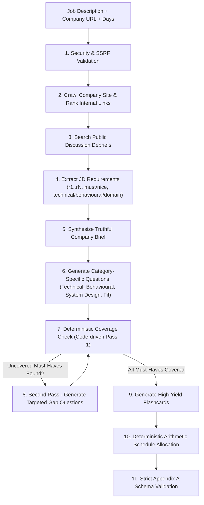

# The AI Interview Prep Kit
**Full-Stack Engineering Assessment | Assessment ID: `FS-AI-INTERVIEW-01` (Trao)**

A production-grade web application and batch evaluation pipeline that transforms a job description and company website URL into a personalized, research-backed interview preparation kit—complete with live company crawling, categorized question banks, flashcards, a day-by-day study schedule, interactive builder editing, and mock interview coaching.

---

## Table of Contents
1. [Project Overview & Tech Stack](#project-overview--tech-stack)
2. [Quickstart & Setup Instructions](#quickstart--setup-instructions)
3. [Batch Entry Point (`npm run evaluate`)](#batch-entry-point-mandatory)
4. [High-Level Architecture](#high-level-architecture)
5. [Crawler & Retrieval Approach](#crawler--retrieval-approach)
6. [Research & Generation Sequencing](#research--generation-sequencing)
7. [The Builder: State Architecture (Generated, Edited, Pinned)](#the-builder-state-architecture)
8. [Deterministic Schedule Allocation](#deterministic-schedule-allocation)
9. [Practice Mode & Spaced Repetition](#practice-mode--spaced-repetition)
10. [Creative Features](#creative-features)
11. [Edge Cases & Failure Handling](#edge-cases--failure-handling)
12. [Security & Prompt Injection Defenses](#security--prompt-injection-defenses)
13. [Automated Test Suite](#automated-test-suite)

---

## Project Overview & Tech Stack

This assessment satisfies all requirements in Trao's engineering brief:

| Layer | Chosen Technology | Justification |
|---|---|---|
| **Frontend** | **Next.js 15 (App Router) + Tailwind CSS** | Server-side rendering, instant client-side state hydration, responsive mobile/desktop layouts, accessible keyboard controls. |
| **Backend** | **Node.js + Express** | Clean separation of concerns between HTTP endpoints, Server-Sent Events (SSE) streaming, and core pipeline logic. |
| **Database** | **MongoDB (Mongoose) + Embedded Fallback** | Full MongoDB support via Mongoose. **Critical Clean-Clone Feature**: If `MONGODB_URI` is not provided or mongod is offline, the app automatically falls back to an embedded JSON datastore (`data/db.json`), ensuring zero-friction setup for reviewers without installing or configuring external services. |
| **Language** | **TypeScript (Strict Mode)** | 100% end-to-end type safety across schemas, API contracts, and evaluation scripts. |
| **Scraping** | **Axios + Cheerio + Heuristic Link Ranker** | Fast, lightweight multi-page crawler with robots.txt compliance, SSRF guardrails, and dynamic link scoring for buried hiring/handbook paths. |
| **LLM Provider** | **Google Gemini (`gemini-2.0-flash` / `gemini-1.5-flash`), Groq, or OpenAI** | Multi-provider architecture with genuine free tier support, token-bucket rate limiting, exponential backoff with jitter, and a built-in Offline Heuristic Mock Engine for test suites and zero-key dry runs. |

---

## Quickstart & Setup Instructions

### 1. Installation
Clone the repository and install dependencies:
```bash
git clone <repo-url>
cd projectJob
npm install
```

### 2. Environment Variables
Copy `.env.example` to `.env`:
```bash
cp .env.example .env
```
*(On Windows PowerShell: `Copy-Item .env.example .env`)*

Documented environment variables:
- `PORT=5000`: Backend API port.
- `ALLOW_LOCAL_URLS=true`: Permits crawling localhost/127.0.0.1 test targets during evaluation.
- `MONGODB_URI`: Optional MongoDB connection string. If blank, zero-config embedded storage is automatically used.
- `JWT_SECRET`: Secret key for JWT user sessions.
- `LLM_PROVIDER`: `gemini` (default), `groq`, `openai`, or `mock`.
- `GEMINI_API_KEY`: Google Gemini API key (recommended free tier from [Google AI Studio](https://aistudio.google.com/)). If no key is set, the system seamlessly uses the offline heuristic engine.

### 3. Running the Web Application
Start both the backend server and frontend development server:
```bash
# Terminal 1: Backend Express API
npm run dev:server

# Terminal 2: Next.js Frontend
npm run dev:client
```
Then navigate to `http://localhost:3000`. Click **"1-Click Evaluator Demo Access"** on the login page for instant access without manual registration!

---

## Batch Entry Point (Mandatory)

Conforming strictly to **Section 9 and Appendix B**, the repository exposes:

```bash
npm run evaluate -- --input <cases.json> --output <kits.json>
```

### Example:
```bash
npm run evaluate -- --input cases.example.json --output test-kits.json
```

### Key Guarantees:
- **Shared Core Pipeline**: Runs the exact same `src/core/pipeline.ts` executed by the web interface—never a parallel implementation.
- **Exact Appendix B Schema**: Produces `{ version: "1.0", generated_at: "...", kits: [ { id, status: "ok"|"failed", kit, error } ] }`.
- **Local Address Compatibility**: Seamlessly crawls `http://localhost:8099/...` without hardcoded hostname assumptions, following relative links.
- **Fault-Tolerant Continuation**: If one case fails (e.g. unreachable domain), the failure is cleanly recorded under `status: "failed"` and subsequent cases continue without aborting the run.
- **Rate-Limit Resilience**: Completes five cases within fifteen minutes through token throttling and exponential backoff.

---

## High-Level Architecture

```
projectJob/
├── src/
│   ├── core/                        # Shared Core Pipeline (Used by both App and Batch CLI)
│   │   ├── crawler/                 # Web Crawler, Robots.txt, Link Ranker, Content Cleaner
│   │   ├── llm/                     # Multi-provider LLM client & rate limiter with backoff
│   │   ├── extraction/              # Job description role & requirement extractor
│   │   ├── generation/              # Company brief, question bank, flashcard generators
│   │   ├── coverage/                # Deterministic coverage gap checker & Pass 2 loop
│   │   ├── scheduler/               # Deterministic arithmetic day-by-day allocator
│   │   ├── validator/               # Strict Zod schema validators (Appendix A & B)
│   │   └── pipeline.ts              # Master orchestration pipeline
│   ├── cli/
│   │   └── evaluate.ts              # Command-line entry point for Section 9 batch evaluation
│   ├── server/                      # Express backend (Auth, persistence, SSE streaming)
│   └── app/                         # Next.js frontend (Builder, Practice, Schedule, Mock)
├── tests/                           # Vitest automated test suite (17/17 tests passing)
├── cases.example.json               # Sample input cases matching Appendix B
└── package.json
```

---

## Crawler & Retrieval Approach

### Discovering Buried Hiring Pages
As required in Section 2, paths like `/careers` or `/jobs` cannot be hard-coded. Companies bury hiring information in engineering handbooks (GitLab), values pages, culture decks, and technical blogs.
- **Link Ranking Algorithm (`src/core/crawler/ranker.ts`)**:
  1. Parses all internal `<a href>` links on the target homepage.
  2. Resolves relative URLs to absolute paths.
  3. Evaluates anchor text, path components, and context using heuristic scoring:
     - High weights: `career`, `jobs`, `join`, `hiring`, `handbook`, `interview`, `engineering-blog`, `culture`, `working-at`.
     - Company overview weights: `about`, `mission`, `what-we-do`, `platform`, `overview`.
     - Negative penalties: `privacy`, `terms`, `cookies`, `login`, `signup`, `cart`, `checkout`.
  4. Discovers and crawls top-ranked pages concurrently.

### Robots.txt Compliance
- Fetches `/robots.txt` before fetching deeper links.
- Respects `Disallow` directives and `Crawl-Delay` headers.

### Public Interview Discussion Search
- Searches public interview discussions and community debriefs (Glassdoor, Reddit, Hacker News).
- **Truthful Reporting Rule**: If no discussions exist or search times out, the system honestly reports: *"No verified public interview debriefs found"*. It **never** fabricates interview rounds or discussions.

---

## Research & Generation Sequencing

The kit is generated through a sequence of deliberate, decoupled stages:



### Deterministic Rules:
1. **Coverage Checking**: Handled strictly in TypeScript code (`src/core/coverage/coverageChecker.ts`), comparing requirement IDs against question reference arrays.
2. **Schedule Allocation**: Handled strictly in TypeScript code (`src/core/scheduler/scheduler.ts`), distributing questions across exactly the requested number of days using integer minutes.

---

## The Builder: State Architecture

Section 6 notes that managing state during partial section regeneration is the hardest problem in the assessment.

### Solution: Provenance & Pinning Metadata
Every item tracks:
```typescript
interface ItemMetadata {
  provenance: "generated" | "edited" | "manual";
  is_pinned: boolean;
}
```

### Partial Regeneration Rules:
1. **Unchanged Categories**: When regenerating "Technical Questions", all other categories ("Behavioural", "System Design", "Company Fit") are 100% untouched.
2. **Inside Target Category**:
   - Any question marked `is_pinned: true` is **preserved**.
   - Any question with `provenance: "edited"` (user modified prompt or answer outline) is **preserved**.
   - Any question with `provenance: "manual"` (user added by hand) is **preserved**.
   - Only unpinned, unedited items (`provenance: "generated" && !is_pinned`) are refreshed with new candidate questions.
3. **Schedule Synchronization**: The schedule is updated deterministically to reflect active question IDs without disturbing other days.

---

## Deterministic Schedule Allocation

Implements **Section 8**:
- **Exact Days**: Number of days in schedule equals `days_available` (tested across 1, 3, 5, 14, and 60 days).
- **Prioritization**:
  - Questions covering `must` requirements and higher difficulty (`difficulty: 3`, then `difficulty: 2`, then `difficulty: 1`) are scheduled on earlier days (Day 1, 2, ...).
  - Behavioural polish and company alignment land on later days.
- **Integer Minutes**: Arithmetic calculation ensures strict integer durations (e.g. 30, 45, 60 mins), eliminating floats.
- **Referential Integrity**: Every `question_ids` entry in the schedule refers to a question that exists in `questions`.
- **Edge Cases**:
  - `days = 1`: Day 1 consolidates all high-yield must-have questions in an "Intensive Crash Prep" session.
  - `days = 60`: Distributes questions across all 60 days with progressive spaced repetition drills; zero empty days.

---

## Practice Mode & Spaced Repetition

Implements **Section 7**:
- **Interactive 3D Flashcards**: Flip card animation with Spacebar or click.
- **Confidence Rating**:
  - `1`: Need Practice (Struggling)
  - `2`: Reviewing (Almost Got It)
  - `3`: Mastered (Confident)
- **Session Queue**: Sorts upcoming flashcards by lowest confidence score first, ensuring the user spends time on what they know least.

---

## Creative Features

### 1. Interactive AI Mock Interviewer & 4-Point Rubric Coach
- Allows candidates to select any question from the kit and rehearse an answer via text or voice dictation (Web Speech API).
- The AI coach scores the answer (0-100) across a 4-point rubric:
  1. Technical Accuracy & Depth (0-25)
  2. Structure & STAR Framework (0-25)
  3. Company & Role Alignment (0-25)
  4. Clarity & Delivery (0-25)
- Provides specific strengths, areas for improvement, and an **Exemplary Model Answer**.

### 2. Printable One-Pager Cheat Sheet
- Accessible at `/kit/[id]/cheat-sheet`.
- High-density layout formatted for Letter/A4 printing or mobile review 30 minutes before the interview.
- Includes company snapshot, top 5 high-yield question frameworks, rapid-recall mental models, and a day-of pre-flight checklist.

---

## Edge Cases & Failure Handling

| Edge Case | Strategy & Behavior |
|---|---|
| **Company URL 404, invalid, or times out** | Does not fail the run. Marks `pages_used: []`, notes failure honestly in `company_brief`, and completes the kit based on the JD. |
| **Site has no discoverable hiring page** | Reports honestly: *"No explicit hiring page discovered"*. Does not fabricate. |
| **Two-line stub JD** | Extracts only what is present without inventing phantom requirements. Produces an honest, concise kit. |
| **Public discussion turns up nothing** | Reports honestly: *"No public interview debriefs found"*. |
| **Model returns invalid JSON** | `extractJsonFromText` strips markdown fences, cleans trailing commas, and validates against Zod schema with automatic retry. |
| **LLM rate-limits or quota errors (429/503)** | `RateLimiter` enforces request intervals and applies exponential backoff with random jitter up to 4 retries. |
| **Duplicate submissions** | System uses unique IDs (`kit_${uuid}`) and idempotent parsing. |
| **1-Day or 60-Day schedule requested** | Arithmetic allocator scales correctly: 1-day crash course vs 60-day spaced reinforcement drills without crashing or leaving empty days. |

---

## Security & Prompt Injection Defenses

Conforming to **Section 11**:
- **SSRF Protection (`src/core/crawler/ssrf.ts`)**: In production, blocks loopback (`127.0.0.1`, `localhost`) and private RFC-1918 CIDRs (`10.0.0.0/8`, `172.16.0.0/12`, `192.168.0.0/16`, AWS metadata `169.254.169.254`). When `ALLOW_LOCAL_URLS=true`, permits local test servers as required by Section 9.
- **Content Size Limits**: Limits HTTP responses to 2MB and cleans HTML down to ~12KB semantic text.
- **Prompt Injection Defense (`src/core/crawler/cleaner.ts`)**: Crawled pages and pasted JDs are treated strictly as untrusted data. Neutralizes injection directives (`ignore previous instructions`, `<system>`, etc.) and isolates content inside `<untrusted_content_...>` delimiters.

---

## Automated Test Suite

Run the automated tests:
```bash
npm test
```

### Test Coverage (17 Tests Passing):
1. **`tests/scheduler.test.ts` (7 tests)**:
   - Verifies exact days count for 1, 3, 5, 14, and 60 days.
   - Verifies integer minutes on all days.
   - Verifies referential integrity (every scheduled ID exists).
   - Verifies all must-have requirements are scheduled.
   - Verifies harder and higher-priority material is scheduled earlier.
2. **`tests/coverage.test.ts` (3 tests)**:
   - Verifies accurate identification of uncovered requirement gaps.
   - Verifies second-pass loop closes must-have gaps and records passes.
   - Verifies no unnecessary extra passes when first draft achieves 100% coverage.
3. **`tests/validator.test.ts` (7 tests)**:
   - Validates Appendix A schema compliance.
   - Rejects invalid categories and difficulties outside 1..3.
   - Rejects non-integer minutes.
   - Catches orphan requirement and question IDs.
   - Validates Appendix B batch input and output schemas.
